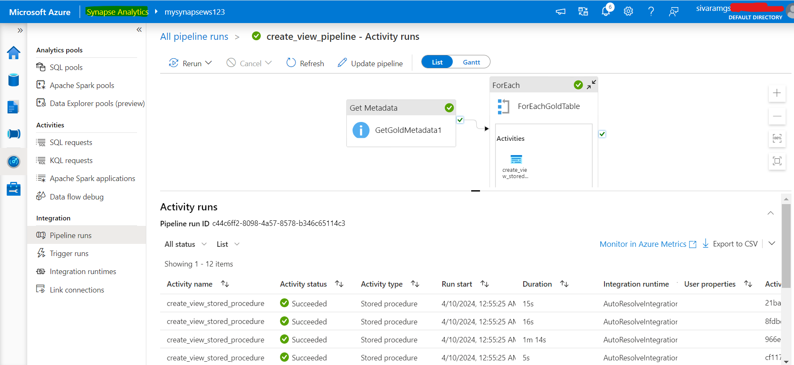

# Project
To implement an end to end data platform from Data Ingestion, Data Transformation, Data Loading and Reporting. 

# High Level Requirements:
- Collect and ingest data from the source system to lakehouse platform.
- Use Azure databricks to transform the RAW data to the most cleanest form of data (Gold Tables).
- Use Azure Synapse Analytics to load the clean data and use Microsoft Power BI to integrate with Azure synapse analytics to build an interactive dashboard.
- Use Azure Active Directory (AAD) and Azure Key Vault for the monitoring and governance purpose.
- Test the data platform Pipeline End to End.
  
# Project Architecture
### 

# Work Done:
## Created Azure Resource Group
- Created the required resources under single resource group: Azure Key Vault, Azure data factory, Azure databricks workspace, Azure synapse analytics, Azure Storage Account
### 

## Created Containers under Azure Storage Account
- Created three containers in ADLS Gen2 Storage for Bronze, Silver and Gold tables used in Azure Databricks.
### 

## Created Secrets under Azure Key Vault
- Created Azure Key vault secrets: 1) password to connect on-prem database server, 2) databricks token to be used in Datafactory pipeline. 
### 

## Configured Azure Data Factory Pipelines - Run results
- Created self-hosted Microsoft Integration Runtime and installed it in on-prem system to connect with Azure Datafactory.
- In Azure Data Factory, created a pipeline with copydata and foreach activities to copy all the table data from on-prem to Azure datalake ALDS Gen2.
    1. Created linked services at the required steps in the pipeline.
    2. Configured an access policy to access azure datalake gen2 in the pipeline.
    3. Configured the source and sink in the pipeline activities and pass the table name dynamically to copy data.
    4. Written databricks pyspark notebook to mount the diffferent azure storage containers : bronze, silver, gold and Passed through the credentials.
    5. Written Bronze_to_Silver transformation code to change the date columns with datetimestamp datatype to date datatype in all tables.
    6. Written Silver_To_Gold code to rename the columns that has two joined words with an "_" underscore in between. eg: ModifiedDate as Modified_Date
    7. Tested the datafactory pipeline end-to-end by loading data from on-prem MSSQL to gold table in Azure Datalake Gen2.
  
### 

## Configured Azure Databricks
### 

## Configured Azure Synapse Analytics Pipelines - Run results
- In Azure Synapse Analytics Studio, created a SQL database as serverless using built-in sql pools with a linked service.
- Written a Stored procedure in synapse analytics to create a view for all tables in gold database.
- In azure synapse , configured a pipeline with activities getmetadata and foreach to automate view creation of all gold tables.
### 

## Created PowerBi Interactive Dashboard with Synapse Analytics Integration
- In powerbi desktop, loaded the data from synapse gold database views and configured the data modelling to create appropriate dashboard visualizations.
- Verified the relationship among the tables and set "cross filter direction" as **both** to apply the filter in required visualizations.
- Used Azure Active Directory to configure a security group and assigned users who can access the resource group resources.
- Scheduled a trigger in datafactory to automate the end-to-end pipeline of the project from data ingestion to report generation in powerbi.
- Verified the pipeline by doing a testing of inserting new records in on-prem MSSQL database and the visualization in powerbi reflects the changes.

### 

# Tech Stack:
- Azure Data Factory
- Azure Data Lake Storage Gen2
- Azure Databricks
- Azure Synapse Analytics
- Azure Key vault
- Azure Active Directory (AAD) and
- Microsoft Power BI
